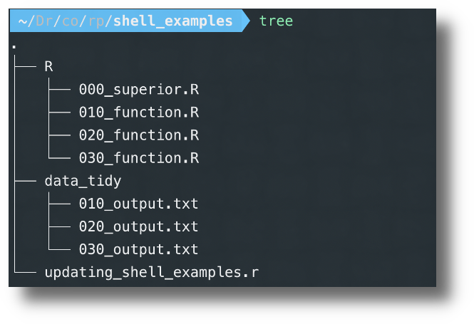

# R Workflow Blog Posts Parts 1 through 3

The above repository was used to demonstrate an R workflow on my [blog](www.robwiederstein.org):

- [Automating R Workflow Part I](https://www.robwiederstein.org/blog/2020/3/28/automating-r-workflow-part-i).
- [Automating R Workflow Part II](https://www.robwiederstein.org/blog/2020/3/28/automating-r-workflow-part-ii).
- [Automating R Workflow Part III](https://www.robwiederstein.org/blog/2020/3/28/automating-r-workflow-part-iii).

## License

Distributed under the MIT License. See `LICENSE` for more information.

<!-- CONTACT -->

 ## Contact

Rob Wiederstein - [@https://twitter.com/RobWiederstein](https://twitter.com/your_username) - rob@robwiederstein.org

Project Link: <https://github.com/RobWiederstein/sample-R-workflow>

<!-- ACKNOWLEDGEMENTS -->

 ## Acknowledgements

Terminal was customized with the advice of Quentin Watt tutorials [here](https://www.youtube.com/watch?v=pTW02GMeI74). The comments contained additional resources.
